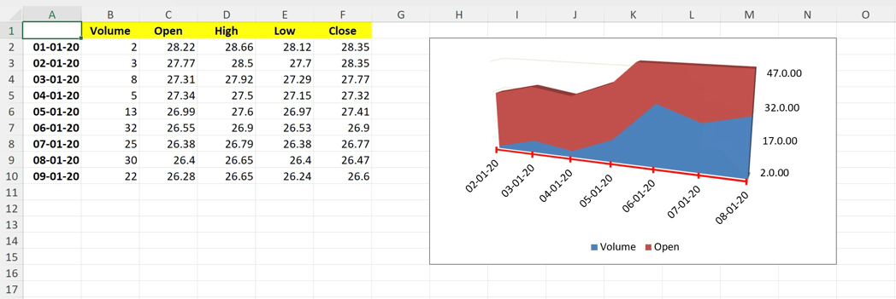

# 3-D Stacked Area chart

This sample demonstrates how to:
- create 3-D Stacked Area chart with multiple series
- set series name
- position the chart
- configure min and max scale on the value and category axes
- configure major and minor units on the value axis
- configure label position on the value axis
- configure number format on the value axis
- configure major and minor tick mark position on the category axis
- configure line style on the category axis

## Output

[workbook.xlsx](./workbook.xlsx)

## Preview

