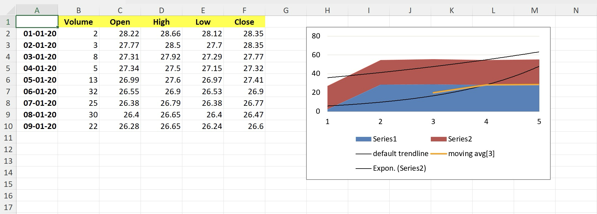

# Stacked Area chart

This sample demonstrates how to:
- create Stacked Area chart with multiple series
- position the chart
- give the chart specific size
- add trendlines to a chart
- add a Linear trendline
- add a Moving Average trendline
- stylize a trendline
- remove existing trendlines

## Output

[workbook.xlsx](./workbook.xlsx)

## Preview

