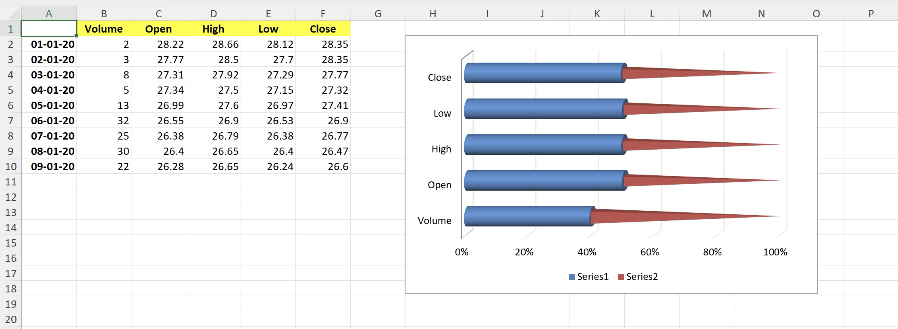

# 3-D 100% Stacked Bar chart

This sample demonstrates how to:
- create 3-D 100% Stacked Bar chart with multiple series
- position the chart
- configure chart's gap width
- configure chart's gap depth
- configure chart's shape
- configure series' shape to override chart's configuration

## Output

[workbook.xlsx](./workbook.xlsx)

## Preview

