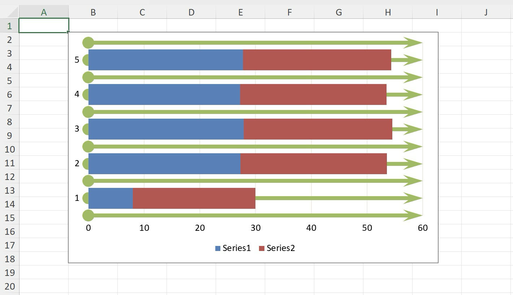

# Stacked Bar chart

This sample demonstrates how to:
- create Stacked Bar chart
- add multiple series with data from different worksheet
- position the chart
- configure chart's gap width
- stylize chart's minor gridlines including color, line width, start and end arrows
- use color from workbook's theme colors

## Output

[workbook.xlsx](./workbook.xlsx)

## Preview

