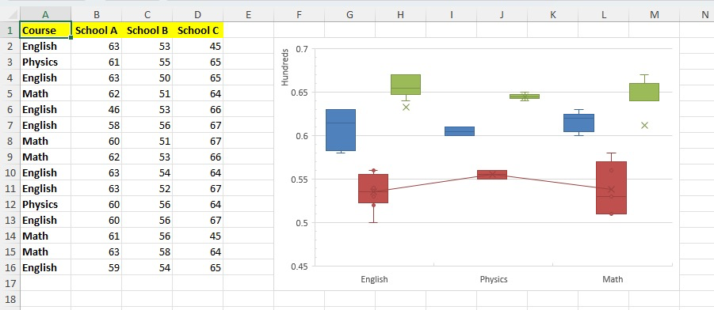

# Box and Whisker chart

This sample demonstrates how to:
- create Box and Whisker chart with multiple series
- position the chart using 2 cell anchor ("Move and size with cells" property in Excel)
- configure series' Gap Width
- configure category axis' major tick marks
- configure value axis' major and minor tick marks
- configure value axis' minimum axis value ("Bounds > Minimum" in Excel)
- configure value axis' "Display units" 
- configure series' Quartile calculation method
- configure series' "Show mean line", "Show mean markers", "Show inner points", "Show outlier points" options

## Output

[workbook.xlsx](./workbook.xlsx)

## Preview

