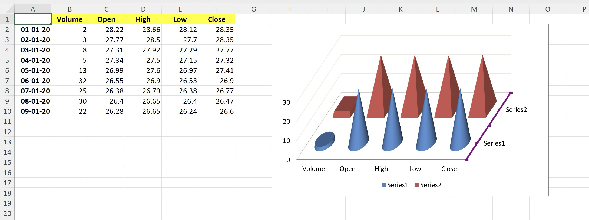

# 3-D Column chart

This sample demonstrates how to:
- create 3-D Column chart with multiple series
- position the chart
- configure 3D rotation over X and Y axes
- configure position of series tick marks
- stylize series axis
- configure chart's gap width
- configure chart's gap depth
- configure chart's 3D shape
- configure per-series 3D shape overriding chart's configuration

## Output

[workbook.xlsx](./workbook.xlsx)

## Preview

