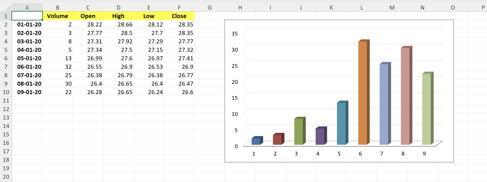

# 3-D Clustered Column chart

This sample demonstrates how to:
- create 3-D Clustered Column chart
- position the chart
- hide the legend
- turn on "Vary colors by point"

## Output

[workbook.xlsx](./workbook.xlsx)

## Preview

