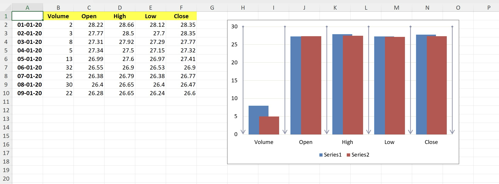

# Clustered Column chart

This sample demonstrates how to:
- create Clustered Column chart with multiple series
- position the chart
- configure chart's gap width
- configure chart's overlap
- stylize chart's major gridlines including color, line width, start and end arrows

## Output

[workbook.xlsx](./workbook.xlsx)

## Preview

