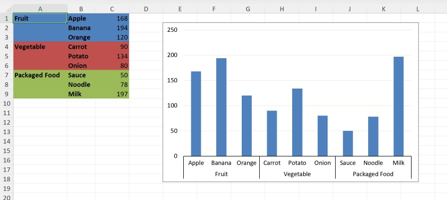

# Clustered Column chart with Multi-level Category labels

This sample demonstrates how to:
- create Clustered Column chart
- position the chart
- hide chart's legend
- apply automatic coloring for category axis lines
- enable "Multi-level Category labels" for the category axis
- configure "Distance from axis" for the category axis labels
- configure "Interval between marks" for the category axis tick marks

## Output

[workbook.xlsx](./workbook.xlsx)

## Preview

