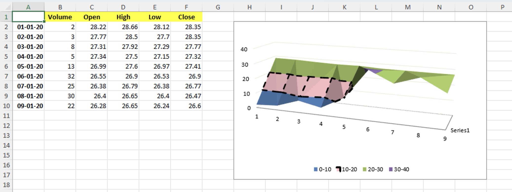

# 3-D Surface chart

This sample demonstrates how to:
- create 3-D Surface chart with multiple series
- position the chart
- stylize chart's colors and borders

## Output

[workbook.xlsx](./workbook.xlsx)

## Preview

