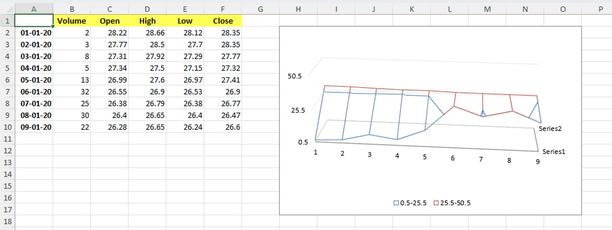

# Wireframe 3-D Surface chart

This sample demonstrates how to:
- create Wireframe 3-D Surface chart with multiple series
- position the chart
- configure value axis' major unit
- configure value axis' minimum value
- configure chart's X and Y 3D rotation

## Output

[workbook.xlsx](./workbook.xlsx)

## Preview

