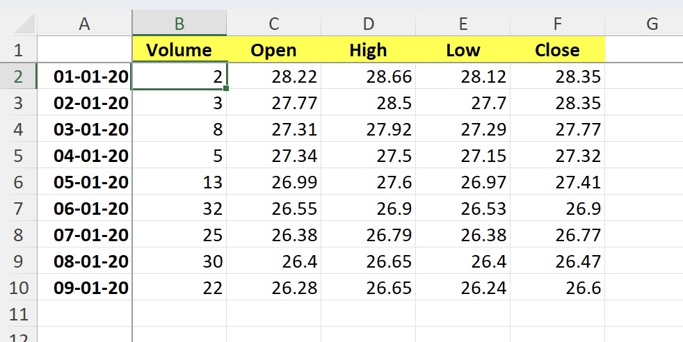

# Freeze panes

This sample demonstrates how to:
- freeze both rows and columns at the same time
- freeze rows or columns separately
- unfreeze rows or columns

The project contains the code for 3 different methods of freezing rows and columns. All of them produce the same output.

## Output

[workbook.xlsx](./workbook.xlsx)

## Preview

